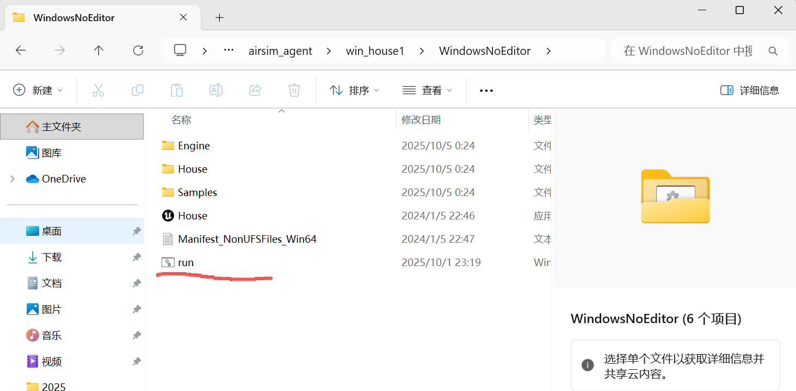
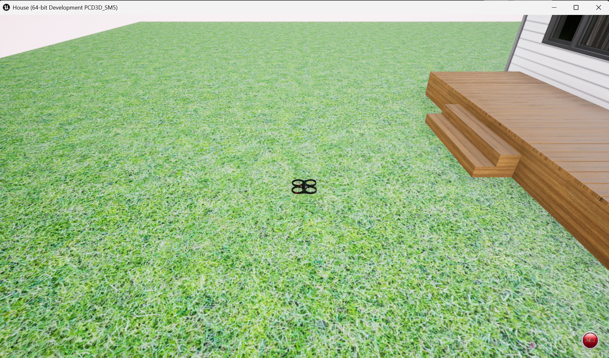

# AirSim 无人机具身智能 Demo

## 项目概述

本项目构建了一个基于 AirSim 仿真环境的具身智能体（Embodied Agent）系统，将大语言模型作为"大脑"与无人机作为"身体"相结合，实现了无人机具身智能应用的一个简单demo。系统核心是一个能够理解自然语言指令、感知环境状态、规划任务步骤并执行物理动作的智能代理。

### Agent 工作流程
**感知-决策-执行循环**  
``
自然语言指令 → LLM理解解析 → 任务规划 → 工具选择 → 
环境感知 → 状态评估 → 动作执行 → 结果反馈 → 
新一轮决策调整
``  
**多模态信息处理流程**  
``
摄像头图像 → 视觉编码 → 目标检测 → 深度融合 → 
空间定位 → 语义理解 → 决策生成
``  
*Agent简介与简易开发流程：*
https://huggingface.co/learn/agents-course/zh-CN/unit0/introduction
## 功能特性

• 🧠 ​​智能决策​​：大语言模型驱动的任务规划和推理能力

• 👁️ ​​多模态感知​​：视觉识别、目标检测、深度环境感知

• 🚁 ​​精准控制​​：无人机起飞、降落、导航、姿态调整

• 🔄 ​​自适应学习​​：基于环境反馈的动态策略调整

• 💬 ​​自然交互​​：支持自然语言指令和视觉问答

## 环境要求
• AirSim 仿真环境  
***安装教程***  
1. AirSim资源下载  
链接: https://pan.baidu.com/s/1wM4cEgXSBX2noIqx5NXPQA 提取码: 1r7i   
AirSim官方文档：https://microsoft.github.io/AirSim/ 
感兴趣可以研究，在本demo中只需简单调用接口即可
2. 启动！  
在windows上解压后双击run脚本即可

AirSim无人机仿真界面

• 代码环境：Anaconda＋pycharm   
***安装教程*** https://deepcode.blog.csdn.net/article/details/136639378   

• 多模态大模型  

doubao-1-5-pro-32k-250115  

dino目标检测大模型
## Agent启动
### conda虚拟环境
1. 命令行创建conda环境  
``
conda create -n airsim_agent python=3.10  
``
2. 激活环境   
``
conda activate airsim_agent
``
3. install依赖项  
``
pip install airsim numpy opencv-python openai pillow smolagents
``
（若后续跑代码时缺失某些模块可以把报错信息丢给AI，AI会告诉需要pip install 哪些包）

### 启动Airsim仿真器
双击run脚本即可

### 启动示例代码
• demo1：*takeoff_demo*  
在simple_agent_demo文件夹中进入虚拟环境，启动  
``
python takeoff_demo.py
``   
便可以调用预定义好的无人机多模态大模型智能体控制无人机起飞啦！

<video controls src="img/20251009_125926.mp4" title="Title"></video>
• demo2：*qlw_test*
本案例是通过我们逐步给无人机Agent指令，使得无人机找到门口并且飞入屋内，检测屋内的物品并在bash中返回，大家也可以执行起来玩一玩  
``
python takeoff_demo.py
``   

### Tips：
我们在simple_agent_demo/airsim_smol_wrapper.py中还预定义好了很多工具，大家可以自行去探索，可以直接询问ai各个工具的含义以及整个代码的框架，具体的教程我们会逐步推出！

